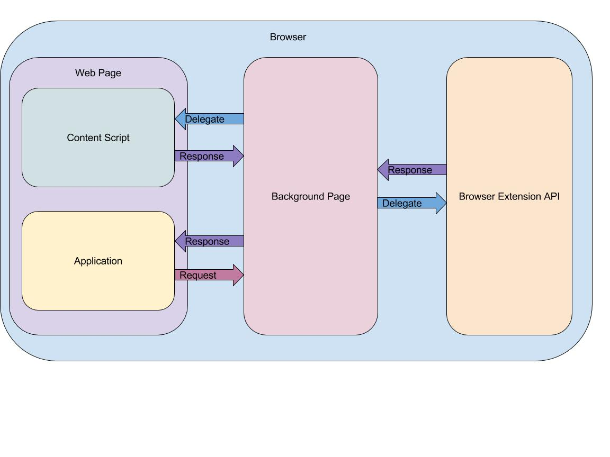

**PLEASE update the documentation (includes jsdoc) accordingly when you make any changes to the code!!!**<br/>
**PLEASE update the documentation (includes jsdoc) accordingly when you make any changes to the code!!!**<br/>
**PLEASE update the documentation (includes jsdoc) accordingly when you make any changes to the code!!!**<br/>

# Setup

## Install Dependencies

Go to terminal and use `npm install` to install all the dependencies. 

## Task Runner

The project uses `grunt` as the task runner and `webpack` to package javascript. `webpack` has already integrated with `grunt`. For `grunt` tasks, see [here](grunt/README.md).

There are a couple of ways to use `grunt`.
 
1. Install `grunt` cli globally using `npm install -g grunt-cli`. And you can run tasks by using `grunt` directly like `grunt ${task name}`
2. Use local installed `grunt` cli (Already installed from [here](#install-dependencies)) and run the tasks like `./node_modules/.bin/grunt ${task name}`.
3. Use shortcut in `npm scripts` which is a reference to `./node_modules/.bin/grunt` and run the tasks like `npm run grunt ${task name}`. 

Either way above works fine. Choose anyone you preferred. 

# Folder Structure

```
/grunt  - Grunt tasks
/locales    - Language files
/src    - Source files
    /app    - Application
    /background-script  - Background script
    /browser-api    - A wrapper over browser extension api
    /browser-api-mock   - A mocked version of the api wrapper
    /content-script    - Content script
    /lib    - Shared libraries
/stub   - stub server
/test   - test folder
/webpack    - webpack config
```

# Development

## Application

### Overview
The whole application uses `angular` to build and uses HTTP to communicate between app and server.
 
### Config
All the app level configurations should go into [here](src/app/core/constant) as constants and define them with the app module.

You can also override the config either through compiling (Using webpack `DefinePlugin`) or define a global object on `window` as `_extensionConfig` with configurations you want to override. Note that if you override them in both ways, the global object on `window` will take precedence over webpack `DefinePlugin`.

### Internalization
`angular-translate` is used for i18n purpose. [I18n Config](src/app/core/config/i18n.js) for configuring all the supported languages (For now, only English), loading `*.properties` files and converting `*.properties` files into `json` (by `webpack`). 

### Browser Extension API
As mentioned in [folder structure](#folder-structure), there is a mocked version of browser extension api which will be used when build the application as a replacement of the actual browser extension api. Every time a new browser extension api is used, a mocked version of that api needs to be created accordingly.
 
Browser extension api provides both `sync` version as well as `async` version for some methods. In order to unify apis, all the methods will use `async` version. The tricky part of using unified `async` apis is: it does not use the `errorback` style of callback, instead, it sets `runtime.lastError` when calls the callback. Also, you still need to apply the `async` calls into `angular` context. In order to make the apis standard across the app, a thin layer of wrapper is created for the purpose (See [here](src/app/browser)).

#### Communicate to Unreachable Browser Extension API and Content Script
There are really limited APIs available in the app runtime (only `storage`, `runtime`, `i18n` and `extension`) and we also need talking to `content_script` to prevent app from directly accessing the host page DOM. 

Fortunately, browser extension API leaves a `runtime.sendMessage` way to communicate to the outside world (extension runtime) and even better, the method has a callback which will be triggered when the message listener sends a response back. With this mechanism, we can abstract the interaction between app and browser extension API/content_script into a request/response (or client/server, RPC) pattern. Within this mode, the client AKA app does not and should not even care about where the server is and how it handles the request. 



### Logging
The app decorates all the log methods (log, info, warn, debug, error) by building a log message payload and adding to a log storage. A special case would be when the first argument is an instance of Error, it will add a `stacktrace` into the payload. 

```
The old implementation is to procude stacktraces for all the log methods. But due to the performance issue, it was changed to the current implementation which only produce stacktrace on error.
```

All the persisted logs will be flushed periodically to a backend service by a timer in background of the app. 

#### LogBody Model
```
{
  "timestamp": 2343456563456,
  "type": "error",
  "message": "message",
  ["context": "context",]
  ["stacktrace": {StackFrame}]
}
```

`context` and `stacktrace` can be optional. `context` will be defined when the log instance is instantiated with `getInstance`. `stacktrace` will be defined when the first argument of log method is an instance of error.

#### Usage
```javascript
const logger = $log.getInstance('Logger Context')
logger.log('log')
logger.info('info')
logger.warn('warn')
logger.debug('debug')
logger.error('error')
```

````
TODO
The stacktrace is generated from source map for a better debugging right now. But for the intellectual property sake, the source map should not be delivered together with the minified code. In that case, the backend service should be responsible to parse the stacktrace from minified code by the same version of source map generated from the build. Check this (https://github.com/mozilla/source-map/) out.
````

## Extension

### Background Page
The background page or even event page which as the name indicates should be a centralized space to register and handler different events. 

This is the "`server`" part of client/server model between app and the outside world including some app-unreachable browser extension API and delegate "request" to content script for some host page DOM behaviors.

### Content Script
The content script is the script which browser extension will "insert" into (kind of) web page depends on the match rules in `manifest.json`. 

In our case, content script is mainly responsible for executing different page parsing rules on different pages. Besides parsing pages, it is also a "`server`" within the messaging client/server model. It takes delegated "request" from app through background page.

## Unit Test

All test files should follow the naming pattern `*.spec.js`. For test files should be executed in browser, it should be named as `*.browser.spec.js`. Otherwise, it will not be loaded into testing environment.

Run `grunt test` to test all the source files and `grunt test:coverage` to test with coverage reports generated and check coverage. 

All tests are written by `mocha` with `chai` as assertion library, `sinon` as spy and stub library together with some other plugins like `sinon-chai`. 

Most of the tests are running in `node` environment. So you can also run `mocha` directly to test individual file like `./node_modules/.bin/mocha ${file path}`. 

For other tests which should be running in `browser` environment, `karma` is used as the test runner. `karma` is a good test runner to run tests within headless browser such as `PhantomJS` or normal browsers such as `Chrome`. 

When to write tests running in `browser`: it take a lot of efforts to mock dependencies if we want to test the app in a `node` environment which can be easily used in a browser environment or some integration tests. A little problem when using `PhantomJS` is that it does not fully support ES6 syntax (See [here](https://github.com/ariya/phantomjs/issues/14506#issuecomment-251611067)) and `webpack` with `babel` loader comes in place to solve this problem.

Note that if you want to import an `angular` module into test context by using shortcut `module({module name})` from `angular.mock`, an `Object is not a constructor` exception will be thrown because `webpack` is overriding `module`. So instead of using `module` as a shortcut, just use `angular.mock.module({module name})` explicitly.
 
# Deployment
TBD
